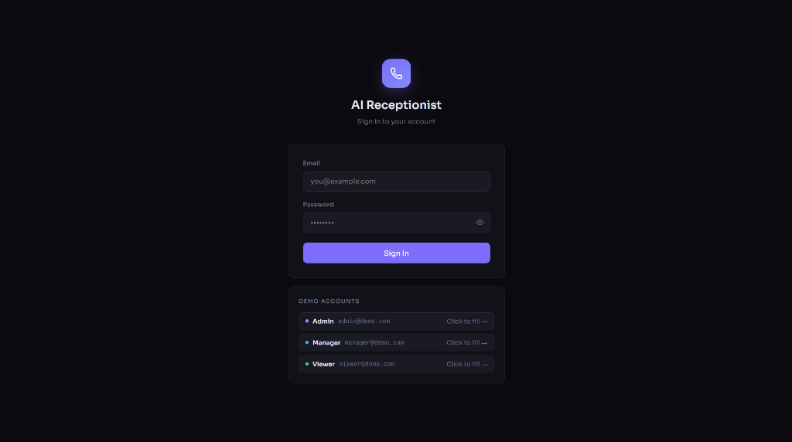
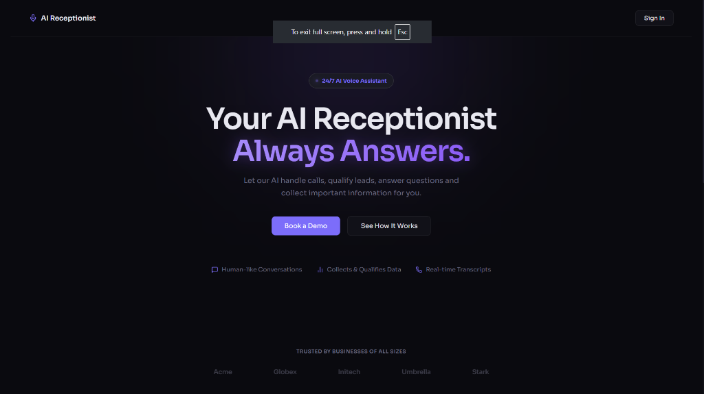
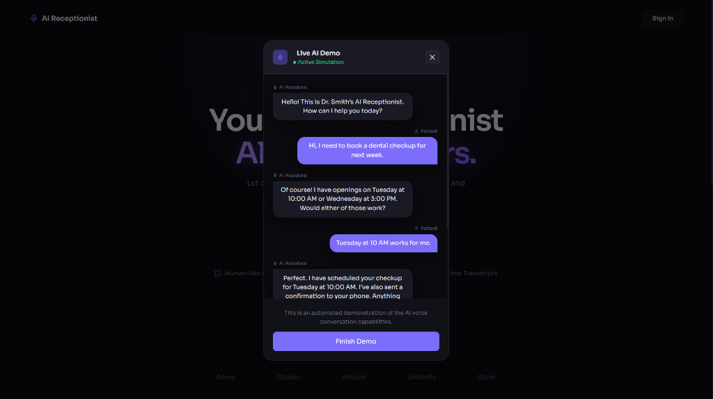
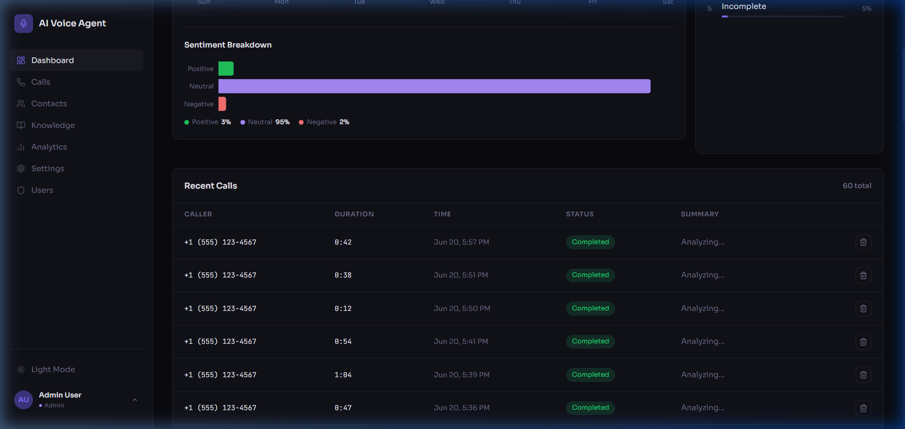

# 🎙️ AI Voice Agent

> **A full-stack, real-time AI voice receptionist** — answers phone calls, holds human-like conversations, qualifies leads, books appointments, and logs every interaction with an AI-generated summary, sentiment score, and transcript. Built for businesses that can't afford to miss a call.

---

## 📸 Screenshots

| Login | Landing Page |
|---|---|
|  |  |

| Live AI Demo | Dashboard |
|---|---|
|  |  |

---

## 🤔 What & Why

### What is it?
AI Voice Agent is a **24/7 autonomous voice receptionist** powered by large language models. Callers speak naturally over a browser-based phone call; the AI listens, understands, and responds with a human-like voice in real time — no scripts, no hold music, no missed calls.

### Why does it exist?
Most small-to-medium businesses lose leads simply because no one answered the phone. Hiring a human receptionist is expensive; traditional IVR trees feel robotic and frustrate callers. AI Voice Agent bridges that gap:

- ✅ Always available — handles calls at 2 AM or during peak hours
- ✅ Understands natural language — not just "press 1 for sales"
- ✅ Learns from a custom knowledge base you control
- ✅ Logs every call automatically — summary, sentiment, outcome, action items
- ✅ Multi-role admin dashboard — review, filter, and act on every call

---

## 🛠️ Tech Stack

### Backend
| Technology | Role |
|---|---|
| **FastAPI** | Async REST API & WebSocket server |
| **Pipecat AI** | Real-time audio pipeline framework |
| **Groq (Whisper large-v3-turbo)** | Speech-to-Text (STT) — ultra-low latency |
| **Groq (LLaMA 3.3 70B Versatile)** | Large Language Model (LLM) reasoning |
| **ElevenLabs** | Text-to-Speech (TTS) — natural voice output |
| **Silero VAD** | Voice Activity Detection — knows when user is speaking |
| **aiosqlite** | Async SQLite database for calls, contacts, knowledge |
| **python-jose + passlib** | JWT authentication & bcrypt password hashing |
| **httpx** | Async HTTP client for Groq API summary calls |

### Frontend
| Technology | Role |
|---|---|
| **React 19 + Vite** | UI framework & dev build tooling |
| **React Router v7** | Client-side routing with protected routes |
| **Zustand** | Lightweight global state management |
| **Recharts** | Analytics charts (line, bar, sentiment) |
| **Lucide React** | Icon library |
| **WebSocket API** | Browser ↔ backend real-time audio streaming |
| **MediaRecorder API** | Captures mic audio in-browser |

---

## 🔄 How It Works — Full Workflow

```
Caller opens browser → clicks "Start Call"
        │
        ▼
   Browser captures microphone audio (MediaRecorder, 16kHz PCM)
        │
        ▼ WebSocket binary stream
   FastAPI /ws endpoint receives audio chunks
        │
        ▼
   ┌─────────── Pipecat Pipeline ───────────────────────────┐
   │                                                        │
   │  1. Silero VAD  ──► detects speech start/stop         │
   │  2. Groq STT    ──► Whisper transcribes audio         │
   │  3. RAG Retriever ─► injects relevant knowledge       │
   │  4. LLaMA 3.3   ──► generates AI response text       │
   │  5. ElevenLabs  ──► synthesizes voice audio           │
   │                                                        │
   └────────────────────────────────────────────────────────┘
        │
        ▼ WebSocket binary audio + JSON events
   Browser plays AI voice audio + updates transcript UI
        │
        ▼  (on call end)
   Groq LLM generates: summary, sentiment, outcome, actions
        │
        ▼
   SQLite: call record saved with full transcript + analysis
```

### Real-time Events (WebSocket JSON messages)
| Event type | Direction | Purpose |
|---|---|---|
| `transcript` | Server → Client | New speech turn (user or AI) |
| `status` | Server → Client | `listening` / `speaking` / `idle` |
| `hangup` | Server → Client | AI detected end-of-call phrase |
| `end_call` | Client → Server | User clicks hang up |
| Binary bytes | Both directions | Raw 16kHz PCM audio |

---

## 🏗️ Architecture

```
┌──────────────────────────────────────────────────────┐
│                    BROWSER (React)                   │
│                                                      │
│  LandingPage → LoginPage → Dashboard                 │
│                              ├── Calls (history)     │
│                              ├── Contacts (CRM)      │
│                              ├── Knowledge Base      │
│                              ├── Analytics           │
│                              └── Settings            │
│                                                      │
│  CallPage: MediaRecorder → WebSocket → AudioPlayer   │
└─────────────────────┬────────────────────────────────┘
                      │  WebSocket (audio + JSON)
                      │  REST (JWT Bearer token)
┌─────────────────────▼────────────────────────────────┐
│                   FASTAPI BACKEND                    │
│                                                      │
│  /auth/login   POST  – JWT token                     │
│  /calls        GET   – call history                  │
│  /contacts     CRUD  – contact management            │
│  /knowledge    CRUD  – knowledge base                │
│  /analytics    GET   – aggregated metrics            │
│  /settings     GET/PUT – agent config                │
│  /ws           WS    – live voice session            │
│                                                      │
│  ┌──────────────────────────────────────┐            │
│  │          agent.py (Pipecat)          │            │
│  │  VAD → STT → RAG → LLM → TTS        │            │
│  └──────────────────────────────────────┘            │
│                                                      │
│  ┌──────────────────────────────────────┐            │
│  │         database.py (aiosqlite)      │            │
│  │  calls | users | contacts | knowledge│            │
│  │  | knowledge_memories               │            │
│  └──────────────────────────────────────┘            │
└──────────────────────────────────────────────────────┘
          │                       │
   ┌──────▼──────┐         ┌──────▼──────┐
   │  Groq API   │         │ ElevenLabs  │
   │  STT + LLM  │         │    TTS      │
   └─────────────┘         └─────────────┘
```

### Key Design Decisions
- **Pipecat pipeline** handles all real-time frame routing — audio in, VAD, STT, LLM, TTS, audio out — as composable async processors.
- **RAG (Retrieval-Augmented Generation)** — on every user utterance, relevant knowledge base articles are dynamically injected into the LLM system prompt.
- **Memory** — the last 3 call summaries are passed to the LLM at session start, giving it context about repeat callers or recurring topics.
- **Double-save protection** — a `call_ended` flag and `_deleted_call_ids` set prevent race conditions between disconnect detection and the agent's natural end.
- **Min call duration (10s)** — junk/accidental connections under 10 seconds are automatically discarded.

---

## 📁 Project Structure

```
ai-receptionist/
├── backend/
│   ├── main.py          # FastAPI app, all REST endpoints, WebSocket handler
│   ├── agent.py         # Pipecat pipeline (VAD → STT → LLM → TTS)
│   ├── database.py      # Async SQLite CRUD layer
│   ├── auth.py          # JWT + bcrypt auth helpers
│   ├── requirements.txt # Python dependencies
│   └── .env             # API keys (not committed)
│
├── frontend/
│   ├── src/
│   │   ├── pages/       # LandingPage, LoginPage, CallPage, Dashboard, etc.
│   │   ├── components/  # Sidebar, TranscriptPanel, CallDetail, charts, etc.
│   │   ├── lib/api.js   # All API calls (REST + mock fallback)
│   │   ├── store/       # Zustand auth store
│   │   ├── context/     # ThemeContext
│   │   └── hooks/       # Custom React hooks
│   ├── index.html
│   └── package.json
│
└── doc/
    └── screenshots/     # UI screenshots
```

---

## ⚙️ Environment Variables

Create `backend/.env` with the following:

```env
GROQ_API_KEY=your_groq_api_key_here
ELEVENLABS_API_KEY=your_elevenlabs_api_key_here
ELEVENLABS_VOICE_ID=your_elevenlabs_voice_id_here
```

Create `frontend/.env` (optional — defaults to localhost):

```env
VITE_API_URL=http://localhost:8000
```

### Getting API Keys
| Service | URL | Free Tier |
|---|---|---|
| Groq | https://console.groq.com | ✅ Yes |
| ElevenLabs | https://elevenlabs.io | ✅ Yes (10k chars/month) |

---

## 🚀 How to Run

### Prerequisites
- **Python 3.10+**
- **Node.js 18+**
- API keys for Groq and ElevenLabs

---

### 1. Backend Setup

```bash
cd backend

# Create and activate virtual environment
python -m venv venv

# Windows
venv\Scripts\activate

# macOS / Linux
source venv/bin/activate

# Install dependencies
pip install -r requirements.txt

# Create your .env file with API keys (see above)
# Then start the server:
uvicorn main:app --reload
```

Backend runs at: **http://localhost:8000**  
API docs at: **http://localhost:8000/docs**

---

### 2. Frontend Setup

```bash
cd frontend

# Install dependencies
npm install

# Start the dev server
npm run dev
```

Frontend runs at: **http://localhost:5173**

---

### 3. Default Demo Accounts

The database seeds these accounts automatically on first run:

| Role | Email | Password |
|---|---|---|
| Admin | admin@demo.com | admin123 |
| Manager | manager@demo.com | manager123 |
| Viewer | viewer@demo.com | viewer123 |

### Role Permissions
| Feature | Admin | Manager | Viewer |
|---|---|---|---|
| View calls & analytics | ✅ | ✅ | ✅ |
| Make a live call | ✅ | ✅ | ✅ |
| Add / delete contacts & knowledge | ✅ | ✅ | ❌ |
| Delete calls | ✅ | ✅ | ❌ |
| Manage users & settings | ✅ | ❌ | ❌ |

---

## ✨ Features

- 🎙️ **Live voice call** — browser-based, no phone number needed
- 🧠 **RAG knowledge base** — feed the AI your FAQs, pricing, hours, policies
- 📊 **Analytics dashboard** — calls per day, sentiment breakdown, top outcomes
- 📋 **Full call history** — searchable, filterable, with per-call transcripts
- 👥 **CRM contacts** — link callers to contact records
- 🔒 **Role-based auth** — Admin / Manager / Viewer with JWT
- 🌙 **Dark mode UI** — glassmorphism design with smooth animations
- ⚡ **Sub-second AI response** — Groq inference is extremely fast

---

## 📄 License

MIT — free to use, modify, and distribute.
